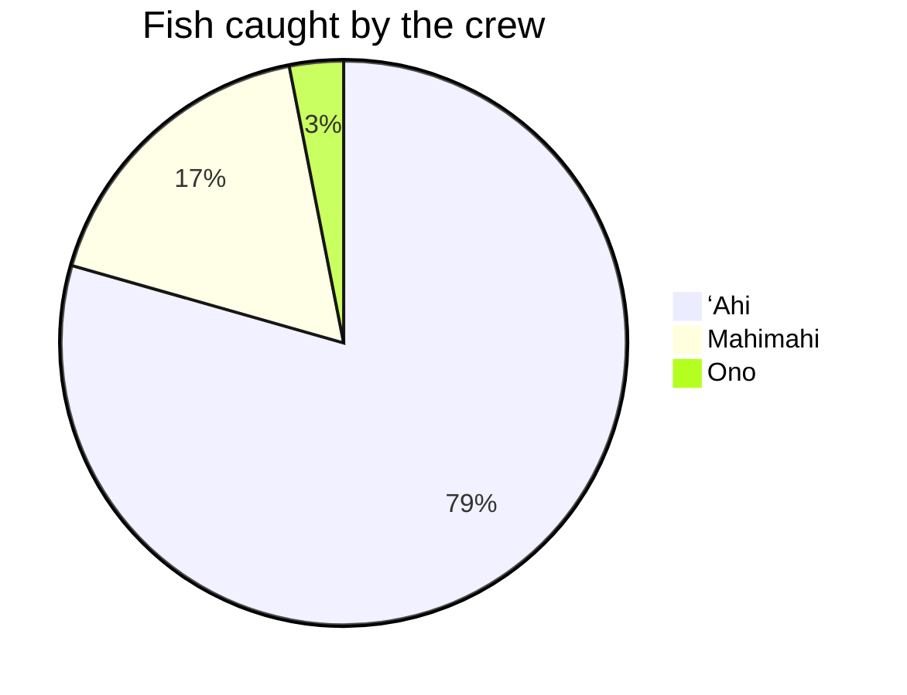

# Pie

Use for: Share of a whole across a handful of categories.

Keyword: `pie`

```mermaid
pie title Fish caught by the crew
    "ʻAhi" : 386
    "Mahimahi" : 85
    "Ono" : 15
```

Source: pele.run examples (MIT), Pele 1.6.0. Full gallery: [Pie examples](https://pele.run/examples/pie).
