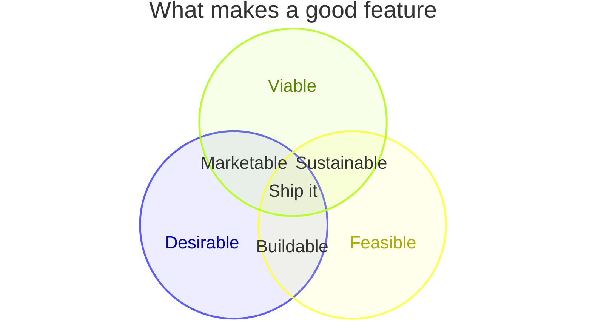
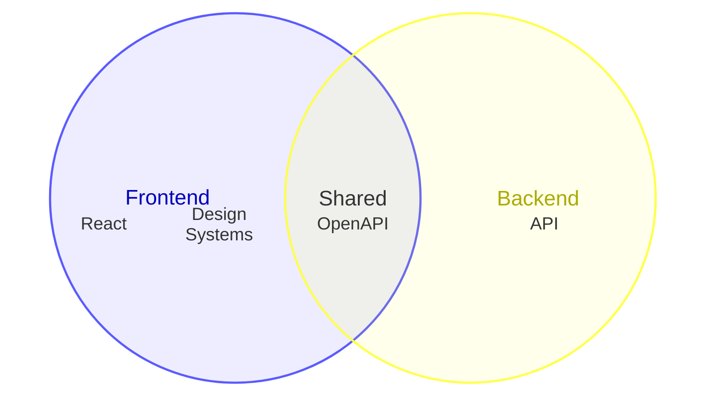

# Venn

Use for: Overlap between two to four sets.

Keyword: `venn-beta`

```mermaid
venn-beta
  title What makes a good feature
  set Desirable
  set Feasible
  set Viable
  union Desirable,Feasible["Buildable"]
  union Feasible,Viable["Sustainable"]
  union Desirable,Viable["Marketable"]
  union Desirable,Feasible,Viable["Ship it"]
```

```mermaid
venn-beta
  set A["Frontend"]
    text A1["React"]
    text A2["Design Systems"]
  set B["Backend"]
    text B1["API"]
  union A,B["Shared"]
    text AB1["OpenAPI"]
```

Source: pele.run examples (MIT), Pele 1.6.0. Full gallery: [Venn examples](https://pele.run/examples/venn).
